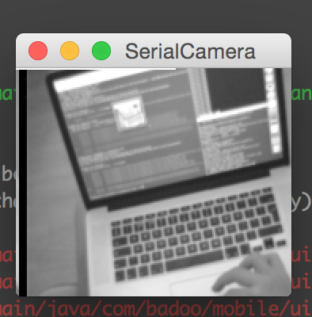

# STM32F4 OV7670 Demo

Demonstration of interfacing the Nucleo STM32F446RE with a OV7670 camera module.



## Building

To build the project you will also need to set up an Eclipse (OpenSTM32) workspace containing the stdperiph library. Except from this there are no external dependencies.

##Running it

After building and flashing the resulting elf file using openocd you can connect to the serial port of the device.
Frames are continuously sent over the serial connection as they are captured by the camera.

To see the camera output you can use the SerialCamera.jar, found under the tools directory:

```
java -jar tools/SerialCamera.jar
```

## Pinout

Since the STM32F's peripherals (Camera interface, I2C, etc) are only available on certain pins, it is important to use the correct ones.

### DCMI

Digital Camera interface, used to read pixel data (on D0..D7).

Pin | Function
--- | ---
PA4 | HREF
PA6 | PCLK
PB7 | VSYNC
PC6 | D0
PC7 | D1
PC8 | D2
PC9 | D3
PC11 | D4
PB6 | D5
PB8 | D6
PB9 | D7

### SCCB

Camera control interface based on I2C.

Pin | Function
--- | ---
PB10 | SIOC
PC12 | SIOD

### Other

Pin | Function
--- | ---
PA8 | MCO (Clock output)

##Credits

This project contains lots of code written by other (very awesome) developers.

* [http://supuntharanga.blogspot.co.uk/2014/04/stm32f4-discovery-board-ov7660-or.html](http://supuntharanga.blogspot.co.uk/2014/04/stm32f4-discovery-board-ov7660-or.html)
* [http://embeddedprogrammer.blogspot.co.uk/2012/07/hacking-ov7670-camera-module-sccb-cheat.html](http://embeddedprogrammer.blogspot.co.uk/2012/07/hacking-ov7670-camera-module-sccb-cheat.html)
* [http://www.urel.feec.vutbr.cz/MPOA/2014/cam-ov7670](http://www.urel.feec.vutbr.cz/MPOA/2014/cam-ov7670)
